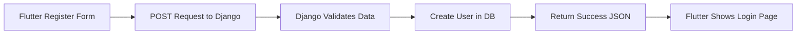
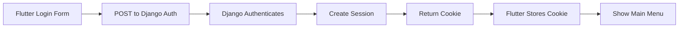
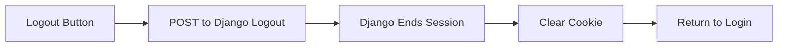

<details>
<Summary><b>Assignment 7</b></Summary>

# How I implemented the [assignment checklist](https://pbp-fasilkom-ui.github.io/ganjil-2025/en/assignments/individual/assignment-7)

First, I created a new flutter project:
```
flutter create coquette_shop_mobile
```

Then, moved `MyHomePage` and the preceding classes from `main.dart` to a new file `menu.dart`.

To add the buttons and change their colors:

`menu.dart`
```dart
  final List<ItemHomepage> items = [
    ItemHomepage("View Product List", Icons.menu, Color(0xFF8ec07c)),
    ItemHomepage("Add Product", Icons.add, Color(0xFFd79921)),
    ItemHomepage("Logout", Icons.logout, Color(0xFFcc241d)),
  ];
```
  
# Assignment questions

### Stateless vs Stateful widgets 
Stateless widgets are immutable, meaning that their properties can't change once created. Stateful widgets can update depending on its current "state". 

### Widgets used for this project
The widgets used here are all Stateless. This is because everything so far is static content, which means we don't have to use Stateful widgets.

### Use for `setState()`

`setState()` is used to modify any variable that is part of the state of a StatefulWidget. 

### `const` vs `final`

`const` variables are variables which value is known at compile time, and are immutable. 

`final` variables are run-time constants. Once its value is set, it cannot be changed, but it does not need to be known at compile time. 

</details>
<details>
<Summary><b>Assignment 8</b></Summary>

# How I implemented the [assignment checklist](https://pbp-fasilkom-ui.github.io/ganjil-2025/en/assignments/individual/assignment-8)


Creating the form page: 
`product_form.dart`

First, I initialized a class `ProductFormPage` to be called later that is a StateFulWidget with `_ProductFormPageState` as its state:

```dart
import 'package:flutter/material.dart';
import '../widgets/left_drawer.dart';

class ProductFormPage extends StatefulWidget {
  const ProductFormPage({super.key});

  @override
  State<ProductFormPage> createState() => _ProductFormPageState();
}

class _ProductFormPageState extends State<ProductFormPage> {
  final _formKey = GlobalKey<FormState>();
```

then gave it the data fields previously used in the Django project:
```dart
  String _product = "";
  String _description = "";
  int _productcoquetteness = 0;
  int _productPrice = 0;
```
Encasing each field with a Scaffold, as well as including the LeftDrawer that will be made later on:
```dart

Widget build(BuildContext context) {
    return Scaffold(
    appBar: AppBar(
    title: const Center(
      child: Text(
        'Add Your Product',
      ),
    ),
    backgroundColor: Theme.of(context).colorScheme.primary,
    foregroundColor: Colors.white,
  ),
  drawer: const LeftDrawer(),
  body: Form(
    key: _formKey,
    child: SingleChildScrollView(
      child: Column(
  crossAxisAlignment: CrossAxisAlignment.start,
  children: [
```
and for each field creating a `Padding` as such:
```dart
Padding(
      padding: const EdgeInsets.all(8.0),
      child: TextFormField(
        decoration: InputDecoration(
          hintText: "product",
          labelText: "product",
          border: OutlineInputBorder(
            borderRadius: BorderRadius.circular(5.0),
          ),
        ),
        onChanged: (String? value) {
          setState(() {
            _product = value!;
          });
        },
        validator: (String? value) {
          if (value == null || value.isEmpty) {
            return "product cannot be empty!";
          }
          return null;
        },
      ),
    ),
    ...
    ...
```
This also ensures that the value is not empty using Flutter's `validator`, and in the case of numbers, use 
```dart
          if (price == null) {
            return "product price must be a number!";
          }
          if (price < 0) {
            return "product price cannot be negative!";
          }
          return null;
          ...
```
After submitting the data via the `save` button, show a popup showing the data that the user just entered:

```dart
showDialog(
        context: context,
        builder: (context) {
          return AlertDialog(
            title: const Text('product successfully saved'),
            content: SingleChildScrollView(
              child: Column(
                crossAxisAlignment: CrossAxisAlignment.start,
                children: [
                  Text('product: $_product'),
                  Text('description: $_description'),
                  Text('coquetteness: $_productcoquetteness'),
                  Text('price: $_productPrice'),
                ],
              ),
            ),
            actions: [
              TextButton(
                child: const Text('OK'),
                onPressed: () {
                  Navigator.pop(context);
                  _formKey.currentState!.reset();
                },
```

Creating the drawer:
`widgets/left_drawer.dart`

Initialized a class named `LeftDrawer` as a `StatelessWidget`:
```dart
import 'package:flutter/material.dart';
import 'package:coquette_shop_mobile/screens/menu.dart';
import 'package:coquette_shop_mobile/screens/product_form.dart';

class LeftDrawer extends StatelessWidget {
  const LeftDrawer({super.key});

  @override
  Widget build(BuildContext context) {
    return Drawer(
      child: ListView(
        children: [
          DrawerHeader(
            decoration: BoxDecoration(
              color: Theme.of(context).colorScheme.primary,
            ),
            child: const Column(
```

Add the application name as a column child of LeftDrawer:
```dart
...
              children: [
                Text(
                  'coquette shop',
                  textAlign: TextAlign.center,
                  style: TextStyle(
                    fontSize: 24,
                    fontWeight: FontWeight.bold,
                    color: Colors.white,
                  ),
                ),
                Padding(padding: EdgeInsets.all(8)),
                Text(
                  'buy coquette items here!',
                  textAlign: TextAlign.center,
                  style: TextStyle(
                    fontSize: 15,
                    color: Colors.white,
                  ),
                ),
              ],
            ),
          ),
...
```

Then add buttons for home and add Product buttons:
```dart
          ListTile(
            leading: const Icon(Icons.home_outlined),
            title: const Text('Home Page'),
            // Redirection part to MyHomePage
            onTap: () {
              Navigator.pushReplacement(
                  context,
                  MaterialPageRoute(
                    builder: (context) => MyHomePage(),
                  ));
            },
          ),
          ListTile(
            leading: const Icon(Icons.inventory),
            title: const Text('Add Product'),
            // Redirection part to ProductFormPage
            onTap: () {
              Navigator.pushReplacement(
                context,
                MaterialPageRoute(builder: (context) => const ProductFormPage()),
              );
            },
          ),
        ],
      ),
    );
  }
}
```

# Assignment Questions

## What is the purpose of const in Flutter? Explain the advantages of using const in Flutter code. When should we use const, and when should it not be used?

const is useful for performance optimization as it is created at compile time - meaning they are only instantiated once. This reduces the overhead of creating multiple instances. They also use less memory. They are used for static content or compile-time constant values. Const should not be used for variables that are expected to change.

## Explain and compare the usage of Column and Row in Flutter. Provide example implementations of each layout widget!


Column: arranges its children in a vertical direction. Example implementation:

```dart
import 'package:flutter/material.dart';

class ColumnExample extends StatelessWidget {
  @override
  Widget build(BuildContext context) {
    return Scaffold(
      appBar: AppBar(
        title: Text('Column Example'),
      ),
      body: Column(
        mainAxisAlignment: MainAxisAlignment.center,
        crossAxisAlignment: CrossAxisAlignment.center,
        children: [
          Text('First Item'),
          Text('Second Item'),
          Text('Third Item'),
        ],
      ),
    );
  }
}

void main() {
  runApp(MaterialApp(
    home: ColumnExample(),
  ));
}
```

Row: arranges its children in a horizontal direction. Example implementation:

```dart
import 'package:flutter/material.dart';

class RowExample extends StatelessWidget {
  @override
  Widget build(BuildContext context) {
    return Scaffold(
      appBar: AppBar(
        title: Text('Row Example'),
      ),
      body: Row(
        mainAxisAlignment: MainAxisAlignment.center,
        crossAxisAlignment: CrossAxisAlignment.center,
        children: [
          Text('First Item'),
          Text('Second Item'),
          Text('Third Item'),
        ],
      ),
    );
  }
}

void main() {
  runApp(MaterialApp(
    home: RowExample(),
  ));
}
```
##  List the input elements you used on the form page in this assignment. Are there other Flutter input elements you didn’t use in this assignment? Explain!

TextFormField was used in ProductFormPage (`product_form.dart`). There are other input elements not used, such as Checkbox, Radio, Switch, Slider, and DropdownButton.

## How do you set the theme within a Flutter application to ensure consistency? Did you implement a theme in your application?

You can set a global theme by defining a ThemeData object and psassing it to the `theme` parameter of all `MaterialApp` widgets. In this application, it is already set in `main.dart`:

```dart
import 'package:flutter/material.dart';
import 'package:coquette_shop_mobile/screens/menu.dart';

void main() {
  runApp(const MyApp());
}

class MyApp extends StatelessWidget {
  const MyApp({super.key});

  @override
  Widget build(BuildContext context) {
    return MaterialApp(
      title: 'coquette-shop',
      debugShowCheckedModeBanner: false,
      theme: ThemeData(
        colorScheme: ColorScheme.fromSeed(seedColor: const Color(0xFF458588)),
        useMaterial3: true,
      ),
      home: MyHomePage(),
    );
  }
}
```

##  How do you manage navigation in a multi-page Flutter application?

Flutter uses a stack to manage page navigation, and as such the buttons in this application use `Navigator.pushReplacement` or `Navigator.push` to redirec the user.
</details>
<detials>
<Summary><b>Assignment 9</b></Summary>

# How I implemented the [assignment checklist](https://pbp-fasilkom-ui.github.io/ganjil-2025/en/assignments/individual/assignment-9)

## Authentication functionality

Creating the Django backend for authentication and integration with Flutter to create products:

```
./manage.py startapp authentication
```

`authentication/views.py`
```py
from django.contrib.auth import authenticate, login as auth_login, logout as auth_logout
from django.http import JsonResponse
from django.views.decorators.csrf import csrf_exempt
from django.contrib.auth.models import User
import json

@csrf_exempt
def login(request):
    username = request.POST['username']
    password = request.POST['password']
    user = authenticate(username=username, password=password)
    if user is not None:
        if user.is_active:
            auth_login(request, user)
            # Successful login status.
            return JsonResponse({
                "username": user.username,
                "status": True,
                "message": "Login successful!"
                # Add other data if you want to send data to Flutter.
            }, status=200)
        else:
            return JsonResponse({
                "status": False,
                "message": "Login failed, account disabled."
            }, status=401)

    else:
        return JsonResponse({
            "status": False,
            "message": "Login failed, check email or password again."
        }, status=401)
    

@csrf_exempt
def register(request):
    if request.method == 'POST':
        data = json.loads(request.body)
        username = data['username']
        password1 = data['password1']
        password2 = data['password2']

        # Check if the passwords match
        if password1 != password2:
            return JsonResponse({
                "status": False,
                "message": "Passwords do not match."
            }, status=400)

        # Check if the username is already taken
        if User.objects.filter(username=username).exists():
            return JsonResponse({
                "status": False,
                "message": "Username already exists."
            }, status=400)

        # Create the new user
        user = User.objects.create_user(username=username, password=password1)
        user.save()

        return JsonResponse({
            "username": user.username,
            "status": 'success',
            "message": "User created successfully!"
        }, status=200)

    else:
        return JsonResponse({
            "status": False,
            "message": "Invalid request method."
        }, status=400)

@csrf_exempt
def logout(request):
    username = request.user.username

    try:
        auth_logout(request)
        return JsonResponse({
            "username": username,
            "status": True,
            "message": "Logged out successfully!"
        }, status=200)
    except:
        return JsonResponse({
        "status": False,
        "message": "Logout failed."
        }, status=401)
```
Then routed them in `authentication/urls.py` 
```py
from django.urls import path
from authentication.views import login, register, logout

app_name = 'authentication'

urlpatterns = [
    path('login/', login, name='login'),
    path('register/', register, name='register'),
    path('logout/', logout, name='logout'),

]
```
For creating products:
`main/views.py`
```py
@csrf_exempt
def create_product_flutter(request):
    if request.method == 'POST':

        data = json.loads(request.body)
        new_product = Product.objects.create(
            user=request.user,
            name=data["name"],
            price=int(data["price"]),
            coquetteness=int(data["coquetteness"]),
            description=data["description"]
        )

        new_product.save()

        return JsonResponse({"status": "success"}, status=200)
    else:
        return JsonResponse({"status": "error"}, status=401)
```
Routing in `main/urls.py`:
```py
from django.urls import path, include
from main.views import (
      ...
    create_product_flutter,
)

app_name = 'main'
urlpatterns = [
    path('', show_main, name = 'show_main'),
        ...
        path('auth/', include('authentication.urls')),
        path('create-flutter/', create_product_flutter, name='create-flutter'),

]
```

Creating Flutter authentication logic:

`register.dart`
```dart
import 'dart:convert';
import 'package:flutter/material.dart';
import 'package:coquette_shop_mobile/screens/login.dart';
import 'package:pbp_django_auth/pbp_django_auth.dart';
import 'package:provider/provider.dart';

class RegisterPage extends StatefulWidget {
  const RegisterPage({super.key});

  @override
  State<RegisterPage> createState() => _RegisterPageState();
}

class _RegisterPageState extends State<RegisterPage> {
  final _usernameController = TextEditingController();
  final _passwordController = TextEditingController();
  final _confirmPasswordController = TextEditingController();

  @override
  Widget build(BuildContext context) {
    final request = context.watch<CookieRequest>();
    return Scaffold(
      appBar: AppBar(
        title: const Text('Register'),
        leading: IconButton(
          icon: const Icon(Icons.arrow_back),
          onPressed: () {
            Navigator.pop(context);
          },
        ),
      ),
      body: Center(
        child: SingleChildScrollView(
          padding: const EdgeInsets.all(16.0),
          child: Card(
            elevation: 8,
            shape: RoundedRectangleBorder(
              borderRadius: BorderRadius.circular(12.0),
            ),
            child: Padding(
              padding: const EdgeInsets.all(20.0),
              child: Column(
                mainAxisSize: MainAxisSize.min,
                children: <Widget>[
                  const Text(
                    'Register',
                    style: TextStyle(
                      fontSize: 24.0,
                      fontWeight: FontWeight.bold,
                    ),
                  ),
                  const SizedBox(height: 30.0),
                  TextFormField(
                    controller: _usernameController,
                    decoration: const InputDecoration(
                      labelText: 'Username',
                      hintText: 'Enter your username',
                      border: OutlineInputBorder(
                        borderRadius: BorderRadius.all(Radius.circular(12.0)),
                      ),
                      contentPadding:
                          EdgeInsets.symmetric(horizontal: 12.0, vertical: 8.0),
                    ),
                    validator: (value) {
                      if (value == null || value.isEmpty) {
                        return 'Please enter your username';
                      }
                      return null;
                    },
                  ),
                  const SizedBox(height: 12.0),
                  TextFormField(
                    controller: _passwordController,
                    decoration: const InputDecoration(
                      labelText: 'Password',
                      hintText: 'Enter your password',
                      border: OutlineInputBorder(
                        borderRadius: BorderRadius.all(Radius.circular(12.0)),
                      ),
                      contentPadding:
                          EdgeInsets.symmetric(horizontal: 12.0, vertical: 8.0),
                    ),
                    obscureText: true,
                    validator: (value) {
                      if (value == null || value.isEmpty) {
                        return 'Please enter your password';
                      }
                      return null;
                    },
                  ),
                  const SizedBox(height: 12.0),
                  TextFormField(
                    controller: _confirmPasswordController,
                    decoration: const InputDecoration(
                      labelText: 'Confirm Password',
                      hintText: 'Confirm your password',
                      border: OutlineInputBorder(
                        borderRadius: BorderRadius.all(Radius.circular(12.0)),
                      ),
                      contentPadding:
                          EdgeInsets.symmetric(horizontal: 12.0, vertical: 8.0),
                    ),
                    obscureText: true,
                    validator: (value) {
                      if (value == null || value.isEmpty) {
                        return 'Please confirm your password';
                      }
                      return null;
                    },
                  ),
                  const SizedBox(height: 24.0),
                  ElevatedButton(
                    onPressed: () async {
                      String username = _usernameController.text;
                      String password1 = _passwordController.text;
                      String password2 = _confirmPasswordController.text;

                      // Check credentials

                      final response = await request.postJson(
                          "http://localhost:8000/auth/register/",
                          jsonEncode({
                            "username": username,
                            "password1": password1,
                            "password2": password2,
                          }));
                      if (context.mounted) {
                        if (response['status'] == 'success') {
                          ScaffoldMessenger.of(context).showSnackBar(
                            const SnackBar(
                              content: Text('Successfully registered!'),
                            ),
                          );
                          Navigator.pushReplacement(
                            context,
                            MaterialPageRoute(
                                builder: (context) => const LoginPage()),
                          );
                        } else {
                          ScaffoldMessenger.of(context).showSnackBar(
                            const SnackBar(
                              content: Text('Failed to register!'),
                            ),
                          );
                        }
                      }
                    },
                    style: ElevatedButton.styleFrom(
                      foregroundColor: Colors.white,
                      minimumSize: const Size(double.infinity, 50),
                      backgroundColor: Theme.of(context).colorScheme.primary,
                      padding: const EdgeInsets.symmetric(vertical: 16.0),
                    ),
                    child: const Text('Register'),
                  ),
                ],
              ),
            ),
          ),
        ),
      ),
    );
  }
}
```
The active part of this code is `final response await request.postJson` in which Flutter sends a POST request to the Django backend with localhost URL to register. A similar approach can be taken in `login.dart`:

```dart
import 'package:coquette_shop_mobile/screens/menu.dart';
import 'package:flutter/material.dart';
import 'package:pbp_django_auth/pbp_django_auth.dart';
import 'package:provider/provider.dart';
import 'package:coquette_shop_mobile/screens/register.dart';

void main() {
  runApp(const LoginApp());
}

class LoginApp extends StatelessWidget {
  const LoginApp({super.key});

  @override
  Widget build(BuildContext context) {
    return MaterialApp(
      title: 'Login',
      theme: ThemeData(
        useMaterial3: true,
        colorScheme: ColorScheme.fromSwatch(
          primarySwatch: Colors.deepPurple,
        ).copyWith(secondary: Colors.deepPurple[400]),
      ),
      home: const LoginPage(),
    );
  }
}

class LoginPage extends StatefulWidget {
  const LoginPage({super.key});

  @override
  State<LoginPage> createState() => _LoginPageState();
}

class _LoginPageState extends State<LoginPage> {
  final TextEditingController _usernameController = TextEditingController();
  final TextEditingController _passwordController = TextEditingController();

  @override
  Widget build(BuildContext context) {
    final request = context.watch<CookieRequest>();

    return Scaffold(
      appBar: AppBar(
        title: const Text('Login'),
      ),
      body: Center(
        child: SingleChildScrollView(
          padding: const EdgeInsets.all(16.0),
          child: Card(
            elevation: 8,
            shape: RoundedRectangleBorder(
              borderRadius: BorderRadius.circular(12.0),
            ),
            child: Padding(
              padding: const EdgeInsets.all(20.0),
              child: Column(
                mainAxisSize: MainAxisSize.min,
                children: [
                  const Text(
                    'Login',
                    style: TextStyle(
                      fontSize: 24.0,
                      fontWeight: FontWeight.bold,
                    ),
                  ),
                  const SizedBox(height: 30.0),
                  TextField(
                    controller: _usernameController,
                    decoration: const InputDecoration(
                      labelText: 'Username',
                      hintText: 'Enter your username',
                      border: OutlineInputBorder(
                        borderRadius: BorderRadius.all(Radius.circular(12.0)),
                      ),
                      contentPadding:
                          EdgeInsets.symmetric(horizontal: 12.0, vertical: 8.0),
                    ),
                  ),
                  const SizedBox(height: 12.0),
                  TextField(
                    controller: _passwordController,
                    decoration: const InputDecoration(
                      labelText: 'Password',
                      hintText: 'Enter your password',
                      border: OutlineInputBorder(
                        borderRadius: BorderRadius.all(Radius.circular(12.0)),
                      ),
                      contentPadding:
                          EdgeInsets.symmetric(horizontal: 12.0, vertical: 8.0),
                    ),
                    obscureText: true,
                  ),
                  const SizedBox(height: 24.0),
                  ElevatedButton(
                    onPressed: () async {
                      String username = _usernameController.text;
                      String password = _passwordController.text;

		  // Check credentials

                      final response = await request
                          .login("http://localhost:8000/auth/login/", {
                        'username': username,
                        'password': password,
                      });

                      if (request.loggedIn) {
                        String message = response['message'];
                        String uname = response['username'];
                        if (context.mounted) {
                          Navigator.pushReplacement(
                            context,
                            MaterialPageRoute(
                                builder: (context) => MyHomePage()),
                          );
                          ScaffoldMessenger.of(context)
                            ..hideCurrentSnackBar()
                            ..showSnackBar(
                              SnackBar(
                                  content:
                                      Text("$message Welcome, $uname.")),
                            );
                        }
                      } else {
                        if (context.mounted) {
                          showDialog(
                            context: context,
                            builder: (context) => AlertDialog(
                              title: const Text('Login Failed'),
                              content: Text(response['message']),
                              actions: [
                                TextButton(
                                  child: const Text('OK'),
                                  onPressed: () {
                                    Navigator.pop(context);
                                  },
                                ),
                              ],
                            ),
                          );
                        }
                      }
                    },
                    style: ElevatedButton.styleFrom(
                      foregroundColor: Colors.white,
                      minimumSize: const Size(double.infinity, 50),
                      backgroundColor: Theme.of(context).colorScheme.primary,
                      padding: const EdgeInsets.symmetric(vertical: 16.0),
                    ),
                    child: const Text('Login'),
                  ),
                  const SizedBox(height: 36.0),
                  GestureDetector(
                    onTap: () {
                      Navigator.push(
                        context,
                        MaterialPageRoute(
                            builder: (context) => const RegisterPage()),
                      );
                    },
                    child: Text(
                      'Don\'t have an account? Register',
                      style: TextStyle(
                        color: Theme.of(context).colorScheme.primary,
                        fontSize: 16.0,
                      ),
                    ),
                  ),
                ],
              ),
            ),
          ),
        ),
      ),
    );
  }
}
```
## Creating prodcut list page:

`list_product.dart`
```dart
import 'package:flutter/material.dart';
import 'package:coquette_shop_mobile/models/product.dart';
import 'package:coquette_shop_mobile/widgets/left_drawer.dart';
import 'package:pbp_django_auth/pbp_django_auth.dart';
import 'package:provider/provider.dart';

class ProductPage extends StatefulWidget {
  const ProductPage({super.key});

  @override
  State<ProductPage> createState() => _ProductPageState();
}

class _ProductPageState extends State<ProductPage> {
  Future<List<Product>> fetchProduct(CookieRequest request) async {
    // Don't forget to add the trailing slash (/) at the end of the URL!
    final response = await request.get('http://localhost:8000/json/');

    // Decoding the response into JSON
    var data = response;

    // Convert json data to a Product object
    List<Product> listProduct = [];
    for (var d in data) {
      if (d != null) {
        listProduct.add(Product.fromJson(d));
      }
    }
    return listProduct;
  }

  @override
  Widget build(BuildContext context) {
    final request = context.watch<CookieRequest>();
    return Scaffold(
      appBar: AppBar(
        title: const Text('Product list'),
      ),
      drawer: const LeftDrawer(),
      body: FutureBuilder(
        future: fetchProduct(request),
        builder: (context, AsyncSnapshot snapshot) {
          if (snapshot.connectionState == ConnectionState.waiting) {
            return const Center(child: CircularProgressIndicator());
          } else if (snapshot.hasError) {
            return Center(child: Text('Error: ${snapshot.error}'));
          } else if (!snapshot.hasData || snapshot.data.isEmpty) {
            return const Column(
              children: [
                Text(
                  'There are no products currently.',
                  style: TextStyle(fontSize: 20, color: Color(0xff59A5D8)),
                ),
                SizedBox(height: 8),
              ],
            );
          } else {
            return ListView.builder(
              itemCount: snapshot.data.length,
              itemBuilder: (_, index) => Container(
                margin: const EdgeInsets.symmetric(horizontal: 16, vertical: 12),
                padding: const EdgeInsets.all(20.0),
                decoration: BoxDecoration(
                  color: Colors.white,
                  borderRadius: BorderRadius.circular(8.0),
                  boxShadow: [
                    BoxShadow(
                      color: Colors.grey.withOpacity(0.5),
                      spreadRadius: 2,
                      blurRadius: 5,
                      offset: const Offset(0, 3),
                    ),
                  ],
                ),
                child: Column(
                  mainAxisAlignment: MainAxisAlignment.start,
                  crossAxisAlignment: CrossAxisAlignment.start,
                  children: [
                    Text(
                      "${snapshot.data[index].fields.name}",  // Changed from product to name
                      style: const TextStyle(
                        fontSize: 18.0,
                        fontWeight: FontWeight.bold,
                      ),
                    ),
                    const SizedBox(height: 10),
                    Text("${snapshot.data[index].fields.description}"),  // Changed from feelings
                    const SizedBox(height: 10),
                    Text("Coquetteness: ${snapshot.data[index].fields.coquetteness}"),  // Changed from productIntensity
                    const SizedBox(height: 10),
                    Text("Price: ${snapshot.data[index].fields.price}")  // Changed from time
                  ],
                ),
              ),
            );
          }
        },
      ),
    );
  }
}
```

This uses an asynchronous request to the Django backend to retrieve all products with the user associated. To accomodate the Django model object, we need to make a custom model in Dart:

`product.dart`
```dart
// To parse this JSON data, do
//
//     final product = productFromJson(jsonString);

import 'dart:convert';

List<Product> productFromJson(String str) => List<Product>.from(json.decode(str).map((x) => Product.fromJson(x)));

String productToJson(List<Product> data) => json.encode(List<dynamic>.from(data.map((x) => x.toJson())));

class Product {
    String model;
    String pk;
    Fields fields;

    Product({
        required this.model,
        required this.pk,
        required this.fields,
    });

    factory Product.fromJson(Map<String, dynamic> json) => Product(
        model: json["model"],
        pk: json["pk"],
        fields: Fields.fromJson(json["fields"]),
    );

    Map<String, dynamic> toJson() => {
        "model": model,
        "pk": pk,
        "fields": fields.toJson(),
    };
}

class Fields {
    int user;
    String name;
    int price;
    String description;
    int coquetteness;

    Fields({
        required this.user,
        required this.name,
        required this.price,
        required this.description,
        required this.coquetteness,
    });

    factory Fields.fromJson(Map<String, dynamic> json) => Fields(
        user: json["user"],
        name: json["name"],
        price: json["price"],
        description: json["description"],
        coquetteness: json["coquetteness"],
    );

    Map<String, dynamic> toJson() => {
        "user": user,
        "name": name,
        "price": price,
        "description": description,
        "coquetteness": coquetteness,
    };
}
```

## Explain why we need to create a model to retrieve or send JSON data. Will an error occur if we don't create a model first?

Creating a model allows us to use a Dart model to parse the data to be used in the application instead of directly using JSON string parsing. Creating a model effectively allows us to automatically handle type conversion and manual parsing.

## Explain the function of the http library that you implemented for this task.

The library allows us to create requests to the Django backend such as POST for login, register, and creating new products, and GET for retrieving product lists.

## Explain the function of CookieRequest and why it’s necessary to share the CookieRequest instance with all components in the Flutter app.

Since we store a cookie when logging in, we need to make request using the login session to retrieve data associated only with the currently logged in user. Else, we would have to send a login request each time.

## Explain the mechanism of data transmission, from input to display in Flutter.
When a product is created in `product_form.dart`, Flutter sends a POST request to the Django backend which will store that product object. When the user uses `product_list.dart` to view all products, Flutter sends a GET request for all product objects associated with the current user using `CookieRequest`. This will return JSON data which is parsed by the Dart model `product.dart` and then displayed in `list_product.dart`.

## Explain the authentication mechanism from login, register, to logout. Start from inputting account data in Flutter to Django’s completion of the authentication process and display of the menu in Flutter.

The flutter register form `register.dart` sends a POST request to Django, where it is then validated in `authentication/views.py` and then creates a User model in the database and returns a HttpResponse indicating success at which point the user is redirected to the login page. 



The flutter login form sends a POST request to Django authentication, where `authentication/views.py` creates a session and returns a Cookie which is then stored in Flutter and the user is redirected to the main menu.



The flutter logout button sends a POST request to Django authentication where Django then ends the session and clears the cookie. The user is then redirected to the login menu.



</details>